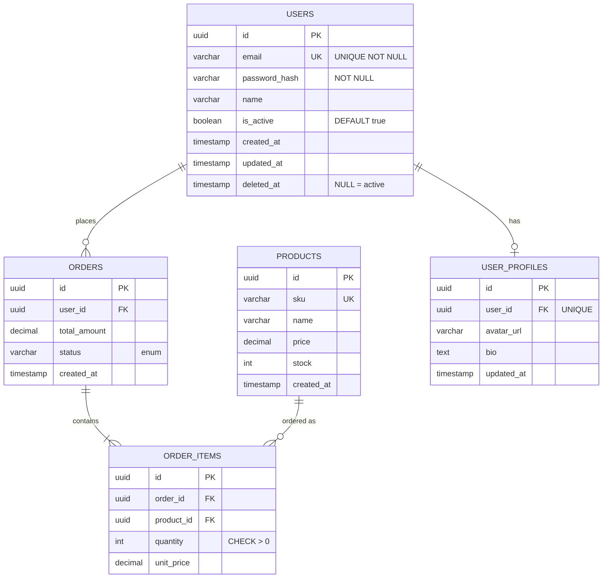

<!--
Database Design Template — Mermaid ERD + table specs
Format: Markdown, hỗ trợ JP / EN / VN
Source: SRS data items (DATA-xxx) + codebase scan (models/migrations).
Numbering: TBL-001, IDX-001, REL-001
-->

# Database Design Document — {{PROJECT_NAME}}

| Field | Value |
|---|---|
| Project | {{PROJECT_NAME}} |
| Version | {{VERSION}} |
| Date | {{DATE}} |
| DB Engine | {{DB_ENGINE}} (PostgreSQL / MySQL / SQLite / MongoDB) |
| Charset | UTF-8 / utf8mb4 |
| Timezone | UTC |
| Language | {{LANG}} |

---

## 1. Overview / 概要

{{DB_OVERVIEW}}

**Conventions:**
- Table names: `snake_case`, plural (`users`, `order_items`).
- Column names: `snake_case`.
- PK: `id` (UUID v4) unless noted.
- FK: `{table}_id` (e.g. `user_id`).
- Timestamps: `created_at`, `updated_at`, `deleted_at` (soft delete).
- Boolean: `is_*` / `has_*` prefix.

---

## 2. Entity Relationship Diagram (ERD)



---

## 3. Tables / テーブル定義

### TBL-001: users

**Purpose / 目的:** {{TABLE_PURPOSE}}
**Related FR:** FR-001, FR-002
**Related DATA:** DATA-001 ~ DATA-005

| # | Column | Type | PK | FK | Null | Default | Constraint | Description |
|---|---|---|---|---|---|---|---|---|
| 1 | id | UUID | Y | - | N | gen_random_uuid() | | Primary key |
| 2 | email | VARCHAR(255) | - | - | N | - | UNIQUE | Login email |
| 3 | password_hash | VARCHAR(255) | - | - | N | - | | bcrypt cost 12 |
| 4 | name | VARCHAR(255) | - | - | N | - | | Display name |
| 5 | is_active | BOOLEAN | - | - | N | true | | Account active flag |
| 6 | created_at | TIMESTAMPTZ | - | - | N | NOW() | | |
| 7 | updated_at | TIMESTAMPTZ | - | - | N | NOW() | | Auto-update trigger |
| 8 | deleted_at | TIMESTAMPTZ | - | - | Y | NULL | | Soft delete |

---

### TBL-002: orders

**Purpose:** {{TABLE_PURPOSE}}

| # | Column | Type | PK | FK | Null | Default | Constraint | Description |
|---|---|---|---|---|---|---|---|---|
| 1 | id | UUID | Y | - | N | gen_random_uuid() | | |
| 2 | user_id | UUID | - | users.id | N | - | ON DELETE RESTRICT | Buyer |
| 3 | total_amount | DECIMAL(12,2) | - | - | N | 0 | CHECK >= 0 | |
| 4 | status | VARCHAR(20) | - | - | N | 'pending' | enum: pending/paid/shipped/cancelled | |
| 5 | created_at | TIMESTAMPTZ | - | - | N | NOW() | | |

---

### TBL-003: order_items

[same structure as above]

---

### TBL-004: products

[same structure as above]

---

## 4. Indexes / インデックス

| IDX-ID | Table | Columns | Type | Purpose |
|---|---|---|---|---|
| IDX-001 | users | email | B-tree UNIQUE | Login lookup |
| IDX-002 | users | deleted_at | B-tree partial WHERE deleted_at IS NULL | Active user filter |
| IDX-003 | orders | user_id, created_at DESC | Composite B-tree | Order history per user |
| IDX-004 | order_items | order_id | B-tree | Join orders → items |
| IDX-005 | products | sku | B-tree UNIQUE | SKU lookup |

```sql
CREATE UNIQUE INDEX idx_users_email ON users(email) WHERE deleted_at IS NULL;
CREATE INDEX idx_orders_user_created ON orders(user_id, created_at DESC);
```

---

## 5. Relationships / リレーション

| REL-ID | Parent | Child | Type | On Delete | On Update | Notes |
|---|---|---|---|---|---|---|
| REL-001 | users | orders | 1:N | RESTRICT | CASCADE | User deletion blocked if has orders |
| REL-002 | users | user_profiles | 1:1 | CASCADE | CASCADE | Profile follows user |
| REL-003 | orders | order_items | 1:N | CASCADE | CASCADE | Items deleted with order |
| REL-004 | products | order_items | 1:N | RESTRICT | CASCADE | Cannot delete product in use |

---

## 6. Enums / 列挙型

### order_status
| Value | Meaning (EN) | 意味 (JA) | Tiếng Việt |
|---|---|---|---|
| pending | Awaiting payment | 支払い待ち | Chờ thanh toán |
| paid | Paid | 支払い済み | Đã thanh toán |
| shipped | Shipped | 発送済み | Đã gửi |
| cancelled | Cancelled | キャンセル | Đã huỷ |

---

## 7. Triggers & Stored Procedures

| Name | Event | Purpose |
|---|---|---|
| trg_users_updated_at | BEFORE UPDATE ON users | Auto-set `updated_at = NOW()` |
| trg_orders_total_check | BEFORE INSERT/UPDATE | Validate total = SUM(items) |

---

## 8. Migration Strategy / マイグレーション戦略

- Tool: {{MIGRATION_TOOL}} (Flyway / Liquibase / Prisma / Alembic / Knex)
- Folder: `migrations/`
- Naming: `YYYYMMDDHHMMSS_description.sql`
- Rollback: every migration must have `down` script
- Seed data: `seeds/` separated from migrations

---

## 9. Backup & Retention / バックアップ

| Item | Policy |
|---|---|
| Full backup | Daily at 03:00 UTC, retain 30d |
| Incremental | Hourly WAL archive |
| Long-term | Monthly snapshot, retain 12mo |
| PITR window | 7 days |

---

## 10. Performance Notes / 性能備考

- Estimated row counts:
  - users: 100K → 1M
  - orders: 1M → 10M (partition by `created_at` monthly when > 5M)
  - order_items: 5M → 50M
- Hot queries:
  - `SELECT ... FROM orders WHERE user_id = ? ORDER BY created_at DESC LIMIT 20` → IDX-003
  - `SELECT ... FROM users WHERE email = ?` → IDX-001

---

## 11. Security / セキュリティ

- PII columns: `users.email`, `users.name` → encrypted at rest (TDE)
- Sensitive: `users.password_hash` → bcrypt cost 12, never log
- Row-level security: `tenant_id` scoping for multi-tenant tables
- Audit log: `audit_logs` table captures CRUD on sensitive tables

---

## Appendix A: Cross-references

- SRS data items: see [srs.md](./srs.md) §5
- API mapping: see [api-docs.md](./api-docs.md) §5
