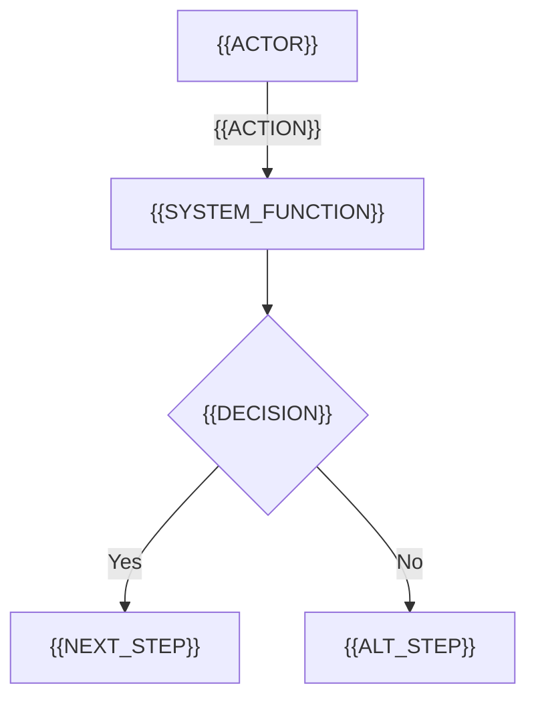
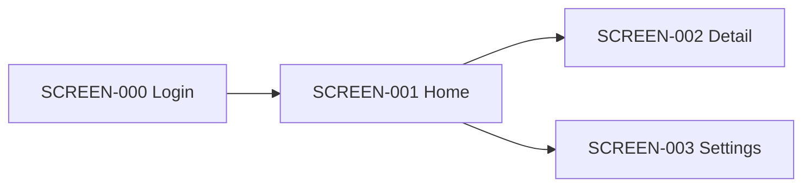

<!--
SRS Template — BrSE chuẩn cho ITO Nhật Bản
Format: Markdown source template.
Rendering rule:
- Source template keeps JA / EN labels for BrSE readability.
- Final customer-facing output must be rendered in ONE selected language: JP | EN | VN.
- When rendering, replace all headings, table headers, enum values, notes, appendix labels, and approval labels with the selected language.
- Glossary can remain multilingual only for internal BrSE documents. For customer-facing documents, keep only the selected language unless agreed otherwise.

Recommended ID numbering:
- UC-001: Use Case
- FR-001: Functional Requirement
- BR-001: Business Rule
- NFR-001: Non-Functional Requirement
- ROLE-001: Role / Permission
- SCREEN-001: Screen
- DATA-001: Data Item
- INT-001: External Interface
- RPT-001: Report / File
- JOB-001: Batch / Scheduled Job
- AC-001: Acceptance Criterion
- TC-001: Test Case
- Q-001: Open Question
- RISK-001: Risk

Related documents:
- Screen design specs: screen-specs/SCREEN-XXX-{slug}.md
- API details: api-docs.md or api-docs/{INT-ID}.md
- Database physical design: database-design.md
- Test cases: test-cases.md or test-cases/{TC-ID}.md
-->

# 要件定義書 / Software Requirements Specification

| Field | Value |
|---|---|
| プロジェクト名 / Project | {{PROJECT_NAME}} |
| リリース / Release | {{RELEASE_NAME}} |
| バージョン / Version | {{VERSION}} |
| 作成日 / Date | {{DATE}} |
| 作成者 / Author | {{BRSE_NAME}} |
| 言語 / Language | {{LANG}} |
| ステータス / Status | Draft / In Review / Reviewed / Approved / Deferred |
| 承認基準日 / Baseline Date | {{BASELINE_DATE}} |

---

## 改訂履歴 / Revision History

| Version | Date | Author | Changes | Reviewer | Approval Status |
|---|---|---|---|---|---|
| 0.1 | {{DATE}} | {{BRSE_NAME}} | Initial draft | {{REVIEWER}} | Draft |

---

## 0. ドキュメント運用ルール / Document Control Rules

### 0.1 言語ルール / Language Rule
- 本テンプレートは BrSE 作業用として JA / EN ラベルを保持する。
- 顧客提出版は `{{LANG}}` に基づき、JP / EN / VN のいずれか 1 言語で出力する。
- 複数言語併記が必要な場合は、顧客・PM・BrSE の合意を得る。

### 0.2 ステータス定義 / Status Definition

| Status | Meaning | Allowed Action |
|---|---|---|
| Draft | 作成中 / Under preparation | BrSE and dev internal review |
| In Review | レビュー中 / Under review | Customer / stakeholder review |
| Reviewed | レビュー済み / Reviewed | Minor correction only |
| Approved | 承認済み / Approved baseline | Change request required for scope change |
| Deferred | 後続対応 / Deferred | Move to future release or backlog |

### 0.3 優先度定義 / Priority Definition

| Priority | Meaning |
|---|---|
| Must | リリースに必須 / Required for release |
| Should | 重要だが代替手段あり / Important but workaround exists |
| Could | 余裕があれば対応 / Nice to have |
| Won't | 今回対象外 / Not included in this release |

---

## 1. 概要 / Overview

### 1.1 目的 / Purpose
{{PROJECT_PURPOSE}}

### 1.2 背景 / Background
{{PROJECT_BACKGROUND}}

### 1.3 対象リリース / Target Release

| Item | Value |
|---|---|
| Release Name | {{RELEASE_NAME}} |
| Target Date | {{TARGET_RELEASE_DATE}} |
| Target Environment | Development / Staging / Production |
| Target Users | {{TARGET_USERS}} |

### 1.4 スコープ / Scope

#### 1.4.1 今回対象範囲 / In-scope for This Release
- {{IN_SCOPE_ITEM_1}}
- {{IN_SCOPE_ITEM_2}}

#### 1.4.2 対象外 / Out-of-scope
- {{OUT_OF_SCOPE_ITEM_1}}
- {{OUT_OF_SCOPE_ITEM_2}}

#### 1.4.3 将来対応 / Future Scope
- {{FUTURE_SCOPE_ITEM_1}}
- {{FUTURE_SCOPE_ITEM_2}}

#### 1.4.4 未確定・要確認 / Pending Confirmation

| Q-ID | Topic | Description | Owner | Due Date | Status |
|---|---|---|---|---|---|
| Q-001 | {{TOPIC}} | {{QUESTION_OR_PENDING_ITEM}} | {{OWNER}} | {{DUE_DATE}} | Open / Answered / Closed |

### 1.5 ステークホルダー / Stakeholders

| ロール / Role | 名称 / Name | 所属 / Organization | 関心事 / Concern | 承認権限 / Approval Authority |
|---|---|---|---|---|
| お客様PM / Customer PM | {{CUSTOMER_PM}} | {{ORG}} | {{CONCERN}} | Yes / No |
| 業務担当 / Business Owner | {{BUSINESS_OWNER}} | {{ORG}} | {{CONCERN}} | Yes / No |
| エンドユーザー / End User | {{USER_ROLE}} | {{ORG}} | {{CONCERN}} | Yes / No |
| BrSE | {{BRSE_NAME}} | {{ORG}} | 要件定義・橋渡し | Yes / No |
| 開発リード / Dev Lead | {{DEV_LEAD}} | {{ORG}} | 実装・技術判断 | Yes / No |
| QA Lead | {{QA_LEAD}} | {{ORG}} | テスト・品質保証 | Yes / No |

### 1.6 参考資料 / References

| Ref-ID | Document / Source | Version / Date | Owner | Notes |
|---|---|---|---|---|
| REF-001 | {{REFERENCE_DOC}} | {{VERSION_OR_DATE}} | {{OWNER}} | {{NOTES}} |

---

## 2. 現状・業務フロー / Current State & Business Flow

### 2.1 現状業務 / Current Business Process
{{CURRENT_PROCESS_DESCRIPTION}}

### 2.2 現状課題 / Current Issues

| Issue-ID | Issue | Impact | Related Process | Owner |
|---|---|---|---|---|
| ISSUE-001 | {{ISSUE}} | High / Mid / Low | {{PROCESS}} | {{OWNER}} |

### 2.3 To-Be 業務フロー / To-Be Business Flow

### 2.4 ユースケース一覧 / Use Case List

| UC-ID | ユースケース名 / Use Case | アクター / Actor | トリガー / Trigger | 主成功シナリオ / Main Success Scenario | 例外 / Exception | 関連FR / Related FR | 優先度 / Priority |
|---|---|---|---|---|---|---|---|
| UC-001 | {{USE_CASE}} | {{ACTOR}} | {{TRIGGER}} | {{MAIN_SUCCESS_SCENARIO}} | {{EXCEPTION}} | FR-001 | Must / Should / Could / Won't |

### 2.5 ユースケース詳細 / Use Case Detail

#### UC-001: {{USE_CASE}}

| Field | Value |
|---|---|
| Actor | {{ACTOR}} |
| Goal | {{USER_GOAL}} |
| Trigger | {{TRIGGER}} |
| Pre-condition | {{PRECONDITION}} |
| Post-condition | {{POSTCONDITION}} |
| Related FR | FR-001 |
| Related Screen | SCREEN-001 |

##### Main Success Scenario
1. {{STEP_1}}
2. {{STEP_2}}
3. {{STEP_3}}

##### Alternate / Exception Scenario
- AS-001: {{ALTERNATE_SCENARIO}}
- ES-001: {{EXCEPTION_SCENARIO}}

---

## 3. 機能要件 / Functional Requirements

### 3.1 機能一覧 / Functional Requirements List

| FR-ID | 機能名 / Function | 概要 / Summary | 関連UC / UC | 画面 / Screen | ロール / Role | 優先度 / Priority | ステータス / Status | Source |
|---|---|---|---|---|---|---|---|---|
| FR-001 | {{FUNCTION_NAME}} | {{SUMMARY}} | UC-001 | SCREEN-001 | {{ROLE}} | Must / Should / Could / Won't | Draft / Reviewed / Approved | REF-001 |

### 3.2 機能詳細 / Functional Details

#### FR-001: {{FUNCTION_NAME}}

| Field | Value |
|---|---|
| Status | Draft / In Review / Reviewed / Approved / Deferred |
| Priority | Must / Should / Could / Won't |
| Source | REF-001 / Meeting {{MEETING_DATE}} / Customer email {{EMAIL_DATE}} |
| Owner | {{OWNER}} |
| Related UC | UC-001 |
| Related Screen | SCREEN-001 |
| Related Data | DATA-001 |
| Related Interface | INT-001 |
| Related NFR | NFR-001, NFR-002 |
| Related Business Rule | BR-001 |
| Related Test Case | TC-001 |

##### Overview
{{DESCRIPTION}}

##### Pre-condition
- {{PRECONDITION}}

##### Trigger
- {{TRIGGER}}

##### Main Flow
1. {{STEP_1}}
2. {{STEP_2}}
3. {{STEP_3}}

##### Alternate Flow
- AF-001: {{ALT_FLOW}}

##### Exception Flow

| EF-ID | Error / Condition | System Behavior | User Message | Log Required |
|---|---|---|---|---|
| EF-001 | {{ERROR_CONDITION}} | {{SYSTEM_BEHAVIOR}} | {{USER_MESSAGE}} | Yes / No |

##### Business Rules
- BR-001: {{BUSINESS_RULE}}

##### Validation Rules

| Field | Rule | Error Message | Timing |
|---|---|---|---|
| {{FIELD}} | {{VALIDATION_RULE}} | {{ERROR_MESSAGE}} | Input / Submit / Import / Batch |

##### Permission

| Role | View | Create | Update | Delete | Approve | Export | Notes |
|---|---|---|---|---|---|---|---|
| {{ROLE}} | Y / N | Y / N | Y / N | Y / N | Y / N | Y / N | {{NOTES}} |

##### Audit Log

| Event | Logged Items | Retention | Related NFR |
|---|---|---|---|
| {{EVENT_NAME}} | {{LOGGED_ITEMS}} | {{RETENTION_PERIOD}} | NFR-003, NFR-005 |

##### Acceptance Criteria
- AC-001: Given {{CONTEXT}}, when {{ACTION}}, then {{EXPECTED_RESULT}}.
- AC-002: Given {{ERROR_CONTEXT}}, when {{ACTION}}, then {{ERROR_EXPECTED_RESULT}}.

##### Test Viewpoints
- Normal case: {{NORMAL_TEST_VIEWPOINT}}
- Boundary case: {{BOUNDARY_TEST_VIEWPOINT}}
- Exception case: {{EXCEPTION_TEST_VIEWPOINT}}
- Permission case: {{PERMISSION_TEST_VIEWPOINT}}

##### Post-condition
- {{POSTCONDITION}}

##### Notes / Open Questions
- Q-001: {{QUESTION_OR_NOTE}}

---

## 4. 業務ルール / Business Rules

| BR-ID | Rule | Related FR | Priority | Source | Owner | Notes |
|---|---|---|---|---|---|---|
| BR-001 | {{BUSINESS_RULE}} | FR-001 | Must / Should / Could / Won't | REF-001 | {{OWNER}} | {{NOTES}} |

---

## 5. 権限 / Roles & Permissions

### 5.1 ロール定義 / Role Definition

| Role-ID | Role Name | Description | User Type | Notes |
|---|---|---|---|---|
| ROLE-001 | {{ROLE_NAME}} | {{ROLE_DESCRIPTION}} | Internal / Customer / Partner / Admin | {{NOTES}} |

### 5.2 権限マトリクス / Permission Matrix

| Role | FR-ID | Screen | View | Create | Update | Delete | Approve | Export | Import | Notes |
|---|---|---|---|---|---|---|---|---|---|---|
| {{ROLE}} | FR-001 | SCREEN-001 | Y / N | Y / N | Y / N | Y / N | Y / N | Y / N | Y / N | {{NOTES}} |

---

## 6. 非機能要件 / Non-Functional Requirements

> NFR categories are based on an IPA-like 6-category structure. If strict IPA compliance is required, confirm the category names, levels, and measurement rules with the customer before approval.

### 6.1 非機能要件一覧 / NFR List

| NFR-ID | Category | Requirement | Target / Metric | Measurement Condition | Priority | Owner | Status |
|---|---|---|---|---|---|---|---|
| NFR-001 | 可用性 / Availability | {{AVAILABILITY_REQ}} | {{UPTIME_TARGET}} | Business hours / 24x7, excluding planned maintenance | Must | {{OWNER}} | Draft |
| NFR-002 | 性能・拡張性 / Performance & Scalability | {{PERF_REQ}} | p95 < {{MS}} ms | Endpoint: {{ENDPOINT}}, data volume: {{DATA_VOLUME}}, concurrent users: {{CONCURRENT_USERS}}, network: {{NETWORK_CONDITION}} | Must | {{OWNER}} | Draft |
| NFR-003 | 運用・保守性 / Operations & Maintainability | {{OPS_REQ}} | Backup: {{BACKUP_RULE}}, log retention: {{RETENTION_PERIOD}} | Environment: {{ENVIRONMENT}}, operation window: {{OPERATION_WINDOW}} | Must | {{OWNER}} | Draft |
| NFR-004 | 移行性 / Migration | {{MIGRATION_REQ}} | {{MIGRATION_TARGET}} | Source system: {{SOURCE_SYSTEM}}, data volume: {{DATA_VOLUME}}, downtime: {{DOWNTIME_LIMIT}} | Should | {{OWNER}} | Draft |
| NFR-005 | セキュリティ / Security | {{SEC_REQ}} | {{SECURITY_STANDARD_OR_CONTROL}} | Scope: {{SECURITY_SCOPE}}, data classification: {{DATA_CLASSIFICATION}} | Must | {{OWNER}} | Draft |
| NFR-006 | システム環境・エコロジー / System Environment & Ecology | {{ENV_REQ}} | {{ENV_TARGET}} | Browser / OS / device / cloud region / energy or resource constraint | Should | {{OWNER}} | Draft |

### 6.2 セキュリティ・個人情報 / Security & PII

| Item | Requirement | Related Data | Related FR | Notes |
|---|---|---|---|---|
| Authentication | {{AUTH_REQUIREMENT}} | DATA-001 | FR-001 | {{NOTES}} |
| Authorization | {{AUTHZ_REQUIREMENT}} | DATA-001 | FR-001 | {{NOTES}} |
| Encryption in transit | {{TLS_OR_NETWORK_REQUIREMENT}} | DATA-001 | INT-001 | {{NOTES}} |
| Encryption at rest | {{STORAGE_ENCRYPTION_REQUIREMENT}} | DATA-001 | FR-001 | {{NOTES}} |
| Audit log | {{AUDIT_LOG_REQUIREMENT}} | DATA-001 | FR-001 | {{NOTES}} |

---

## 7. データ項目定義 / Data Item Definitions

### 7.1 主要エンティティ / Main Entities
詳細 ERD は別紙 `database-design.md` 参照。
Physical DB design such as index, FK, collation, partitioning, and storage engine should be described in `database-design.md`.

| Entity-ID | Entity | Business Meaning | Owner | Notes |
|---|---|---|---|---|
| ENT-001 | {{ENTITY_NAME}} | {{BUSINESS_MEANING}} | {{OWNER}} | {{NOTES}} |

### 7.2 データ項目一覧 / Data Item List

| DATA-ID | Entity | Field | Business Meaning | Example | Type | Length | Null | Validation | Constraint | PII | Source | Update Timing | Notes |
|---|---|---|---|---|---|---|---|---|---|---|---|---|---|
| DATA-001 | users | id | User identifier | 550e8400-e29b-41d4-a716-446655440000 | UUID | 36 | N | Auto-generated | PK | N | System | On create | {{NOTES}} |
| DATA-002 | users | email | Login ID of user | user@example.com | VARCHAR | 255 | N | Email format, unique | UNIQUE | Y / N | User input | On registration / update | {{NOTES}} |

### 7.3 データ保持・削除 / Data Retention & Deletion

| Data / Entity | Retention Period | Deletion Trigger | Backup Handling | Legal / Compliance Notes |
|---|---|---|---|---|
| {{DATA_OR_ENTITY}} | {{RETENTION_PERIOD}} | {{DELETION_TRIGGER}} | {{BACKUP_HANDLING}} | {{COMPLIANCE_NOTES}} |

---

## 8. 外部インターフェース / External Interfaces

詳細 API 仕様は別紙 `api-docs.md` または `api-docs/{INT-ID}.md` 参照。

| INT-ID | Name | Direction | Type | Target System | Protocol | Auth | Format | Timing | Retry | Timeout | Error Handling | Owner | Related FR |
|---|---|---|---|---|---|---|---|---|---|---|---|---|---|
| INT-001 | {{INTERFACE_NAME}} | Inbound / Outbound | REST API / File / DB / Webhook | {{TARGET}} | HTTPS / SFTP / JDBC | {{AUTH_METHOD}} | JSON / CSV / XML / Fixed-length | Real-time / Batch / Manual | {{RETRY_RULE}} | {{TIMEOUT}} | {{ERROR_HANDLING}} | {{OWNER}} | FR-001 |

### 8.1 ファイル連携詳細 / File Interface Detail

| INT-ID | File Name Pattern | Charset | Delimiter | Header | Compression | Duplicate Handling | Archive Rule |
|---|---|---|---|---|---|---|---|
| INT-001 | {{FILE_NAME_PATTERN}} | UTF-8 / Shift_JIS | Comma / Tab / Fixed | Yes / No | None / ZIP / GZIP | {{DUPLICATE_HANDLING}} | {{ARCHIVE_RULE}} |

---

## 9. 帳票・ファイル / Reports & Files

| RPT-ID | Name | Type | Output Format | Trigger | Target User | Data Source | Layout Spec | Related FR | Notes |
|---|---|---|---|---|---|---|---|---|---|
| RPT-001 | {{REPORT_OR_FILE_NAME}} | Report / CSV Export / PDF / Excel / Print | CSV / PDF / XLSX | Manual / Batch / Event | {{ROLE}} | {{DATA_SOURCE}} | {{LAYOUT_SPEC_LINK}} | FR-001 | {{NOTES}} |

### 9.1 帳票・ファイル項目 / Report / File Items

| RPT-ID | No. | Output Field | Source Data | Format | Required | Sort / Group | Notes |
|---|---|---|---|---|---|---|---|
| RPT-001 | 1 | {{OUTPUT_FIELD}} | DATA-001 | {{FORMAT}} | Y / N | {{SORT_OR_GROUP}} | {{NOTES}} |

## 10. 受入条件・UAT / Acceptance Criteria & UAT

### 10.1 受入条件一覧 / Acceptance Criteria List

| AC-ID | Acceptance Criterion | Related FR | Related UC | Related Test Case | Owner | Status |
|---|---|---|---|---|---|---|
| AC-001 | Given {{CONTEXT}}, when {{ACTION}}, then {{EXPECTED_RESULT}}. | FR-001 | UC-001 | TC-001 | {{OWNER}} | Draft / Reviewed / Approved |

### 10.2 UAT 判定基準 / UAT Exit Criteria

| Criteria-ID | Criteria | Target | Measurement / Evidence | Owner |
|---|---|---|---|---|
| UAT-001 | Must-priority FR completed | 100% | Traceability matrix and test result | {{OWNER}} |
| UAT-002 | Critical / High defects closed | 100% | Defect report | {{OWNER}} |
| UAT-003 | Customer approval completed | Yes | Approval record | {{OWNER}} |

---

## 11. トレーサビリティ / Traceability Matrix

| FR-ID | UC-ID | BR-ID | Screen ID | DATA-ID | INT-ID | NFR-ID | RPT-ID | JOB-ID | AC-ID | Test Case ID | Status |
|---|---|---|---|---|---|---|---|---|---|---|---|
| FR-001 | UC-001 | BR-001 | SCREEN-001 | DATA-001 | INT-001 | NFR-001 | RPT-001 | JOB-001 | AC-001 | TC-001 | Draft / Reviewed / Approved |

---

## 12. 未決事項・Q&A / Open Issues & Q&A

| Q-ID | Date | Category | Question / Issue | Answer / Decision | Owner | Due Date | Status | Related ID |
|---|---|---|---|---|---|---|---|---|
| Q-001 | {{DATE}} | Scope / FR / NFR / Data / UI / Interface / Ops | {{QUESTION}} | {{ANSWER_OR_DECISION}} | {{OWNER}} | {{DUE_DATE}} | Open / Answered / Closed | FR-001 |

---

## 13. 制約・前提・リスク / Constraints, Assumptions & Risks

### 13.1 制約 / Constraints

| Constraint-ID | Category | Constraint | Impact | Owner |
|---|---|---|---|---|
| CONS-001 | Tech / Ops / Compliance / Schedule / Budget | {{CONSTRAINT}} | {{IMPACT}} | {{OWNER}} |

### 13.2 前提 / Assumptions

| Assumption-ID | Assumption | Impact if False | Owner | Validation Method |
|---|---|---|---|---|
| ASM-001 | {{ASSUMPTION}} | {{IMPACT_IF_FALSE}} | {{OWNER}} | {{VALIDATION_METHOD}} |

### 13.3 リスク / Risks

| Risk-ID | Risk | Impact | Likelihood | Mitigation | Owner | Status |
|---|---|---|---|---|---|---|
| RISK-001 | {{RISK}} | High / Mid / Low | High / Mid / Low | {{MITIGATION}} | {{OWNER}} | Open / Monitoring / Closed |

---

## Appendix A: 画面設計書 一覧 / Screen Design Spec Index

各画面の詳細仕様は別ファイル: `screen-specs/SCREEN-XXX-{slug}.md`
Each screen detail spec lives in: `screen-specs/SCREEN-XXX-{slug}.md`

### A.1 Screen List

| Screen ID | Screen Name | Related FR | Role | File | Status |
|---|---|---|---|---|---|
| SCREEN-000 | Login | FR-001 | {{ROLE}} | [screen-specs/SCREEN-000-login.md](./screen-specs/SCREEN-000-login.md) | Draft |
| SCREEN-001 | {{SCREEN_NAME}} | FR-001 | {{ROLE}} | [screen-specs/SCREEN-001-{{slug}}.md](./screen-specs/SCREEN-001-{{slug}}.md) | Draft |
| SCREEN-002 | {{SCREEN_NAME}} | FR-002 | {{ROLE}} | [screen-specs/SCREEN-002-{{slug}}.md](./screen-specs/SCREEN-002-{{slug}}.md) | Draft |
| SCREEN-003 | Settings | FR-003 | {{ROLE}} | [screen-specs/SCREEN-003-settings.md](./screen-specs/SCREEN-003-settings.md) | Draft |

### A.2 Global Screen Transition Map

### A.3 Screen Spec Minimum Contents

Each screen spec should include:
- Screen purpose
- URL / route
- Role permission
- Input item list
- Output item list
- Button / action list
- Validation rules
- Error messages
- Screen transition rules
- Related FR / DATA / INT / NFR

---

## Appendix B: 用語集 / Glossary

| 用語 / Term (JA) | English | Tiếng Việt | 定義 / Definition |
|---|---|---|---|
| 要件定義書 | SRS | Tài liệu đặc tả yêu cầu | Software Requirements Specification |
| 画面設計書 | Screen Design Spec | Tài liệu thiết kế màn hình | Per-screen UI / IO specification |
| 業務フロー | Business Flow | Luồng nghiệp vụ | End-to-end business process |
| 受入条件 | Acceptance Criteria | Điều kiện nghiệm thu | Criteria used to confirm whether a requirement is accepted |
| トレーサビリティ | Traceability | Truy vết yêu cầu | Mapping between requirement, screen, data, interface, NFR, and test case |

---

