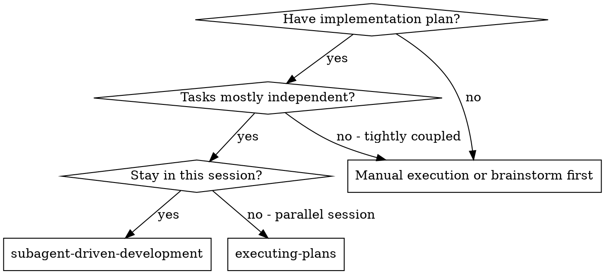
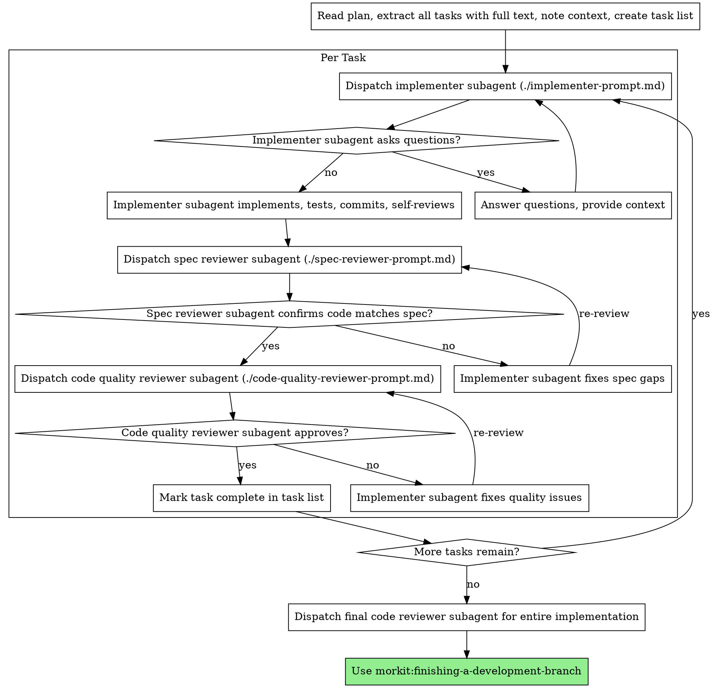

# Subagent-Driven Development

<!-- PRESERVED MANUAL EDIT — Codex-only insertion (R1 fix).
     Do NOT delete on re-sync. If re-running scripts/sync-codex-fork.sh, the
     regenerated file will lose this block; re-apply it manually afterwards.
     The Claude-path skill in skills/ does not need this — its gate fires on
     a skill-dispatch matcher, not on file-mutation tools, so it doesn't need
     MORKIT_CURRENT_CHANGE. See .codex/.drift-baseline for the post-edit
     hash. -->

## Pre-flight: export MORKIT_CURRENT_CHANGE so the gate engages

The plugin's PreToolUse hook (`hooks/pre-tool-checklist-gate.sh`) blocks
`apply_patch` / `Edit` / `Write` until the active change's
`review-checklist.md` has `Overall Decision: OK`. In Codex there's no `Skill`
tool, so the hook narrows by env var: **if `MORKIT_CURRENT_CHANGE` is unset,
the gate fails open** and every dispatched subagent's edits proceed
unguarded.

**BEFORE dispatching any implementer subagent** in this skill, run the
snippet below in your controller session so the gate has the change name to
look up. Subagents inherit the controller's env, so a single export covers
all dispatches:

```bash
# Detect the active change (most recently modified non-archive dir under
# morkit/output/spec/, with MORKIT_ROOT override honored). Export the basename
# so pre-tool-checklist-gate.sh can resolve <PRIMARY>/$MORKIT_CURRENT_CHANGE.
CHANGE_DIR=$(find "${MORKIT_ROOT:-morkit/output/spec}" \
                  -mindepth 1 -maxdepth 1 -type d ! -name archive -print0 \
                  2>/dev/null \
    | xargs -0 -I{} sh -c \
        'stat -f "%m %N" "$1" 2>/dev/null || stat -c "%Y %n" "$1"' _ {} \
    | sort -rn | head -1 | sed 's/^[0-9]* //')

if [[ -n "$CHANGE_DIR" ]]; then
    export MORKIT_CURRENT_CHANGE="$(basename "$CHANGE_DIR")"
fi
```

If `MORKIT_CURRENT_CHANGE` is already set (e.g. exported by the user or a
parent shell) leave it alone — the snippet only auto-detects when unset.

Execute plan by dispatching fresh subagent per task, with two-stage review after each: spec compliance review first, then code quality review.

**Why subagents:** You delegate tasks to specialized agents with isolated context. By precisely crafting their instructions and context, you ensure they stay focused and succeed at their task. They should never inherit your session's context or history — you construct exactly what they need. This also preserves your own context for coordination work.

**Core principle:** Fresh subagent per task + two-stage review (spec then quality) = high quality, fast iteration

## When to Use



**vs. Executing Plans (parallel session):**
- Same session (no context switch)
- Fresh subagent per task (no context pollution)
- Two-stage review after each task: spec compliance first, then code quality
- Faster iteration (no human-in-loop between tasks)

## The Process



## Pre-Implementation Validation (run once per session, before any subagent dispatch)

**Before extracting tasks and dispatching the first implementer**, read the project's reference docs (when present in `./docs/`) so every implementer subagent inherits the same conventions, structure, and architecture context:

- `docs/codebase-summary.md` — repo layout, tech stack, entry points (where things live)
- `docs/code-standards.md` — naming, formatting, lint, commit conventions (how to write things)
- `docs/system-architecture.md` — components, layers, interactions (how things fit together)

If a doc is missing, skip it silently — do NOT block on missing docs and do NOT generate them as a side effect (use `/morkit:init` for that). When dispatching an implementer subagent, **paste the relevant excerpts** (not the whole file) into the prompt's context block — the subagent has no inherited context. If a doc conflicts with the plan, surface the conflict to your human partner before dispatching.

## Model Selection

Use the least powerful model that can handle each role to conserve cost and increase speed.

**Mechanical implementation tasks** (isolated functions, clear specs, 1-2 files): use a fast, cheap model. Most implementation tasks are mechanical when the plan is well-specified.

**Integration and judgment tasks** (multi-file coordination, pattern matching, debugging): use a standard model.

**Architecture, design, and review tasks**: use the most capable available model.

**Task complexity signals:**
- Touches 1-2 files with a complete spec → cheap model
- Touches multiple files with integration concerns → standard model
- Requires design judgment or broad codebase understanding → most capable model

## Handling Implementer Status

Implementer subagents report one of four statuses. Handle each appropriately:

**DONE:** Proceed to spec compliance review.

**DONE_WITH_CONCERNS:** The implementer completed the work but flagged doubts. Read the concerns before proceeding. If the concerns are about correctness or scope, address them before review. If they're observations (e.g., "this file is getting large"), note them and proceed to review.

**NEEDS_CONTEXT:** The implementer needs information that wasn't provided. Provide the missing context and re-dispatch.

**BLOCKED:** The implementer cannot complete the task. Assess the blocker:
1. If it's a context problem, provide more context and re-dispatch with the same model
2. If the task requires more reasoning, re-dispatch with a more capable model
3. If the task is too large, break it into smaller pieces
4. If the plan itself is wrong, escalate to the human

**Never** ignore an escalation or force the same model to retry without changes. If the implementer said it's stuck, something needs to change.

## Prompt Templates

- `./implementer-prompt.md` - Dispatch implementer subagent
- `./spec-reviewer-prompt.md` - Dispatch spec compliance reviewer subagent
- `./code-quality-reviewer-prompt.md` - Dispatch code quality reviewer subagent

## Example Workflow

```
You: I'm using Subagent-Driven Development to execute this plan.

[Read plan file once: morkit/output/plans/feature-plan.md]
[Extract all 5 tasks with full text and context]
[Create task list with all tasks]

Task 1: Hook installation script

[Get Task 1 text and context (already extracted)]
[Dispatch implementation subagent with full task text + context]

Implementer: "Before I begin - should the hook be installed at user or system level?"

You: "User level (~/.config/morkit/hooks/)"

Implementer: "Got it. Implementing now..."
[Later] Implementer:
  - Implemented install-hook command
  - Added tests, 5/5 passing
  - Self-review: Found I missed --force flag, added it
  - Committed

[Dispatch spec compliance reviewer]
Spec reviewer: ✅ Spec compliant - all requirements met, nothing extra

[Get git SHAs, dispatch code quality reviewer]
Code reviewer: Strengths: Good test coverage, clean. Issues: None. Approved.

[Mark Task 1 complete]

Task 2: Recovery modes

[Get Task 2 text and context (already extracted)]
[Dispatch implementation subagent with full task text + context]

Implementer: [No questions, proceeds]
Implementer:
  - Added verify/repair modes
  - 8/8 tests passing
  - Self-review: All good
  - Committed

[Dispatch spec compliance reviewer]
Spec reviewer: ❌ Issues:
  - Missing: Progress reporting (spec says "report every 100 items")
  - Extra: Added --json flag (not requested)

[Implementer fixes issues]
Implementer: Removed --json flag, added progress reporting

[Spec reviewer reviews again]
Spec reviewer: ✅ Spec compliant now

[Dispatch code quality reviewer]
Code reviewer: Strengths: Solid. Issues (Important): Magic number (100)

[Implementer fixes]
Implementer: Extracted PROGRESS_INTERVAL constant

[Code reviewer reviews again]
Code reviewer: ✅ Approved

[Mark Task 2 complete]

...

[After all tasks]
[Dispatch final code-reviewer]
Final reviewer: All requirements met, ready to merge

Done!
```

## Advantages

**vs. Manual execution:**
- Subagents follow TDD naturally
- Fresh context per task (no confusion)
- Parallel-safe (subagents don't interfere)
- Subagent can ask questions (before AND during work)

**vs. Executing Plans:**
- Same session (no handoff)
- Continuous progress (no waiting)
- Review checkpoints automatic

**Efficiency gains:**
- No file reading overhead (controller provides full text)
- Controller curates exactly what context is needed
- Subagent gets complete information upfront
- Questions surfaced before work begins (not after)

**Quality gates:**
- Self-review catches issues before handoff
- Two-stage review: spec compliance, then code quality
- Review loops ensure fixes actually work
- Spec compliance prevents over/under-building
- Code quality ensures implementation is well-built

**Cost:**
- More subagent invocations (implementer + 2 reviewers per task)
- Controller does more prep work (extracting all tasks upfront)
- Review loops add iterations
- But catches issues early (cheaper than debugging later)

## Red Flags

**Never:**
- Start implementation on main/master branch without explicit user consent
- Skip reviews (spec compliance OR code quality)
- Proceed with unfixed issues
- Dispatch multiple implementation subagents in parallel (conflicts)
- Make subagent read plan file (provide full text instead)
- Skip scene-setting context (subagent needs to understand where task fits)
- Ignore subagent questions (answer before letting them proceed)
- Accept "close enough" on spec compliance (spec reviewer found issues = not done)
- Skip review loops (reviewer found issues = implementer fixes = review again)
- Let implementer self-review replace actual review (both are needed)
- **Start code quality review before spec compliance is ✅** (wrong order)
- Move to next task while either review has open issues

**If subagent asks questions:**
- Answer clearly and completely
- Provide additional context if needed
- Don't rush them into implementation

**If reviewer finds issues:**
- Implementer (same subagent) fixes them
- Reviewer reviews again
- Repeat until approved
- Don't skip the re-review

**If subagent fails task:**
- Dispatch fix subagent with specific instructions
- Don't try to fix manually (context pollution)

## Integration

**Required workflow skills:**
- **morkit:using-git-worktrees** - REQUIRED: Set up isolated workspace before starting
- **morkit:writing-plans** - Creates the plan this skill executes
- **morkit:requesting-code-review** - Code review template for reviewer subagents
- **morkit:finishing-a-development-branch** - Complete development after all tasks

**Subagents should use:**
- **morkit:test-driven-development** - Subagents follow TDD for each task

**Alternative workflow:**
- **morkit:executing-plans** - Use for parallel session instead of same-session execution

---

## Library research with Context7 (Mor overlay)

When this skill needs accurate, version-specific library/framework documentation (Tech Stack design, API verification, debugging library behaviour, writing tests against a library API), prefer **Context7** over generic web search to avoid hallucinated APIs from stale training data.

**MCP path (preferred when Context7 MCP installed) — two tool calls:**

1. `mcp__context7__resolve-library-id` with `libraryName` (e.g. `"React"`) + `query` (the topic) → returns Context7 IDs like `/reactjs/react.dev`. Skip this step if the user already gave you an ID in `/org/project` form.
2. `mcp__context7__query-docs` with `libraryId` (from step 1) + `query` (be specific). Retry once with `researchMode: true` if the first answer is too shallow. Each tool ≤ 3 calls per question.

**CLI fallback (no setup needed; uses npx cache):**
```bash
# Step 1 — resolve the library to a Context7 ID
npx -y ctx7 library "<library-name>" "<topic>"   # e.g. "React" "hooks" → /reactjs/react.dev

# Step 2 — query docs for that ID
npx -y ctx7 docs "<library-id>" "<topic>"
```

When you encounter a library API you're not 100% certain about — query Context7 first, then proceed. Cheaper than discovering the bug at test time or rewriting after.


---
## Pre-flight: developer review checklist must be approved (Mor overlay)

**BEFORE starting any work in this skill** — especially before reading the plan, dispatching subagents, or making any code change — verify the OpenSpec change has an approved review checklist.

```bash
# Detect most recent non-archive change
CHANGE_DIR="$(find openspec/changes -mindepth 1 -maxdepth 1 -type d ! -name 'archive' \
                -exec stat -f "%m %N" {} \; 2>/dev/null \
              | sort -rn | head -1 | awk '{print $2}')"
CHECKLIST="$CHANGE_DIR/review-checklist.md"

if [ ! -f "$CHECKLIST" ]; then
    echo "✗ STOP: $CHECKLIST does not exist. Run /morkit:review."
    exit 1
fi
if ! grep -qE '^[[:space:]]*Overall Decision:[[:space:]]*OK[[:space:]]*$' "$CHECKLIST"; then
    echo "✗ STOP: $CHECKLIST not approved. Set 'Overall Decision: OK' first."
    exit 1
fi
```

Skip this gate ONLY when there is no `openspec/changes/` folder in the project (this skill is being used outside the spec-driven workflow).

The plugin's PreToolUse hook also enforces this at the harness level. This skill-level check is defense-in-depth: if the hook is bypassed (e.g., disabled in user settings), this check still refuses to proceed.

*This pre-flight requirement is added by the Mor overlay, not part of upstream Superpowers.*
