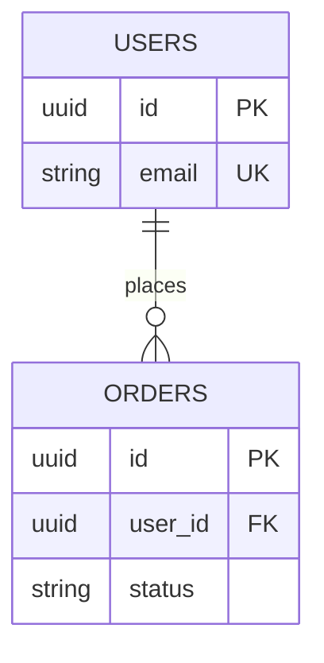

# Data Map

<!-- BOUNDARY: Schema detail (full DDL) → ../../90-reference/REFERENCE.md.
     Data dependency list → ../../00-overview/DEPENDENCY-MAP.md. -->
> This doc holds table roles and key-column summaries.
> Full DDL/schema → [REFERENCE](../90-reference/REFERENCE.md).
> External data dependencies → [DEPENDENCY-MAP](../../00-overview/DEPENDENCY-MAP.md).

---

<!--
## MODE SELECTION
Two modes — pick ONE; delete the other section before publishing.

MAP-MODE (default — recommended when source code/migrations exist)
  · Lists table roles + key columns only. Pointers to schema source.
  · Stays stale-proof: no DDL duplication.
  · Use this when: migrations / ORM models / schema.sql are present.

FULL-MODE (design-first — no source schema yet)
  · Embeds full column specs + ERD in this file.
  · Use this when: greenfield design, no schema source to point to.
  · Switch to MAP-MODE once schema source is committed.
-->

<!-- ═══════════════════════════════════════════════════════
     MAP-MODE — delete this block if using FULL-MODE
     ═══════════════════════════════════════════════════════ -->

## <Group A> Tables
<!-- hint: group tables by domain/bounded-context, e.g. "Core", "Audit", "Settings" -->

### `<table_name>`
<!-- hint: one subsection per table -->

Role: <placeholder — one sentence on what this table stores and why>

| Column | Purpose |
|---|---|
| `id` | Primary key |
| `<column>` | <!-- hint: add key columns only; omit obvious timestamp cols --> |

Keys / indexes:
<!-- hint: unique key tuple or named indexes that affect query patterns -->
```text
UNIQUE (<col_a>, <col_b>)
INDEX  (<col_c>)
```

Schema detail → [REFERENCE](../90-reference/REFERENCE.md) — grep `CREATE TABLE <table_name>`.

---

### `<table_name_2>`

Role: <placeholder>

| Column | Purpose |
|---|---|
| `<column>` | <placeholder> |

---

## <Group B> Tables
<!-- Example group: "Lookup / Config" -->

### `<table_name_3>`

Role: <placeholder>

| Column | Purpose |
|---|---|
| `<column>` | <placeholder> |

---

## Data Ownership
<!-- hint: state which service/module WRITES each table group; who only reads -->
- `<table_name>` — owned by `<service/module>`; read by `<other>`.
- `<table_name_2>` — owned by `<service/module>`.

<!-- END MAP-MODE -->


<!-- ═══════════════════════════════════════════════════════
     FULL-MODE — use when design-first (no schema source yet).
     Delete this block if using MAP-MODE.
     ═══════════════════════════════════════════════════════ -->

<!--
## ERD


## Tables

### TBL-001: `<table_name>`

Purpose: <placeholder>

| # | Column | Type | PK | FK | Null | Default | Notes |
|---|---|---|---|---|---|---|---|
| 1 | id | UUID | Y | — | N | gen_random_uuid() | |
| 2 | <column> | VARCHAR(255) | — | — | N | — | <placeholder> |
| 3 | created_at | TIMESTAMPTZ | — | — | N | NOW() | |
| 4 | updated_at | TIMESTAMPTZ | — | — | N | NOW() | |

### TBL-002: `<table_name_2>`

Purpose: <placeholder>

| # | Column | Type | PK | FK | Null | Default | Notes |
|---|---|---|---|---|---|---|---|
| 1 | id | UUID | Y | — | N | gen_random_uuid() | |
| 2 | <col> | <type> | — | — | N | — | <placeholder> |

## Indexes

| IDX-ID | Table | Columns | Type | Purpose |
|---|---|---|---|---|
| IDX-001 | <table_name> | <col> | B-tree UNIQUE | <placeholder> |
| IDX-002 | <table_name_2> | <col_a>, <col_b> | Composite | <placeholder> |

## Relationships

| REL-ID | Parent | Child | Type | On Delete | Notes |
|---|---|---|---|---|---|
| REL-001 | <parent_table> | <child_table> | 1:N | RESTRICT | <placeholder> |

## Enums

### `<enum_name>`
| Value | Meaning |
|---|---|
| `<value>` | <placeholder> |

## Migration Strategy
- Tool: <placeholder — Flyway / Prisma / Alembic / Knex>
- Folder: `migrations/`
- Naming: `YYYYMMDDHHMMSS_description.sql`
- Every migration must have a `down` script.

## Security
- PII columns: `<table>.<col>` → <placeholder — encryption policy>
- Audit: <placeholder — describe audit log approach if any>
-->

<!-- END FULL-MODE -->
