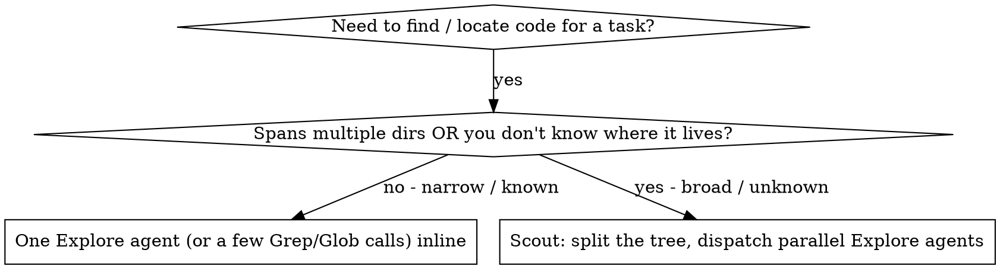

# Scout

Fast, token-efficient codebase scouting. You dispatch parallel `Explore` agents to find
the files a task touches, then fold their findings into one short report. File **contents**
stay in the sub-agents' context — you keep only paths and one-line descriptions, so your own
context stays clean for the real work.

This skill is the *file-discovery* specialization of
[dispatching-parallel-agents](../dispatching-parallel-agents/SKILL.md): same core principle
(one agent per independent domain, isolated context, parallel execution), with the "domain"
being a slice of the directory tree.

## When to Use



Reach for scout when:

- Starting a feature that spans multiple directories.
- The user says "find", "locate", "where is", or asks how the project is structured.
- Opening a debug session that needs to understand file relationships first.
- Before a change that may affect many parts of the codebase.

**Do not over-spawn.** If the search fits 1–2 directories or you already know where the code
is, run Grep/Glob (or a single Explore agent) inline — the parallel-dispatch overhead only
pays off at ~3+ independent directory slices.

## Workflow

### 1. Analyze the task
Parse the request for search targets: key terms, directories, file types, likely entry points.

### 2. Estimate scale
Use a few wide `Grep`/`Glob` patterns to gauge how many files/dirs are in play. Decide how
many Explore agents to spawn — **one per logical directory slice, with no overlap**. Fewer is
better; only split when coverage genuinely needs it.

### 3. Dispatch parallel Explore agents
Spawn all `Explore` agents in a **single message** so they run concurrently. Per
[dispatching-parallel-agents](../dispatching-parallel-agents/SKILL.md), give each agent only
what it needs — exact directories to search and the task it's searching for. Each agent:

- Uses Glob/Grep to discover relevant files in its assigned slice.
- Returns a short list of `path — description`, plus any notable patterns.
- Has a **3-minute** budget; skip non-responders, do not restart them.

Prompt template per agent:

```
Quickly scout {DIRECTORIES} for files related to: {TASK}

- Use Glob/Grep for discovery; read only excerpts, not whole files.
- Return: `path/file.ext — one-line description`.
- Note key patterns or relationships you see.
- Stay within 3 minutes; report what you have.
```

### 4. Collect results
Deduplicate paths, merge descriptions, and note any slices that timed out or returned nothing.
Aggregate into a single report and list gaps as unresolved questions.

## Report Format

```markdown
# Scout Report

## Relevant Files
- `path/to/file.ext` — brief description
- ...

## Patterns / Relationships
- Notable patterns observed (optional)

## Unresolved Questions
- Any gaps in coverage or timed-out slices
```

## Workflow Position

**Investigation chain:** `scout → systematic-debugging → brainstorming → writing-plans` —
scout locates the code and gathers context, then later skills investigate, explore options, and plan.

**Typically precedes:** `/morkit:systematic-debugging`, implementation skills, and code review —
scout locates the code, then the next skill acts on it.
**Related:**
- [brainstorming](../brainstorming/SKILL.md) — explore ideas/options *after* scouting has gathered the context.
- [dispatching-parallel-agents](../dispatching-parallel-agents/SKILL.md) — general parallel-task version of the same dispatch pattern.
